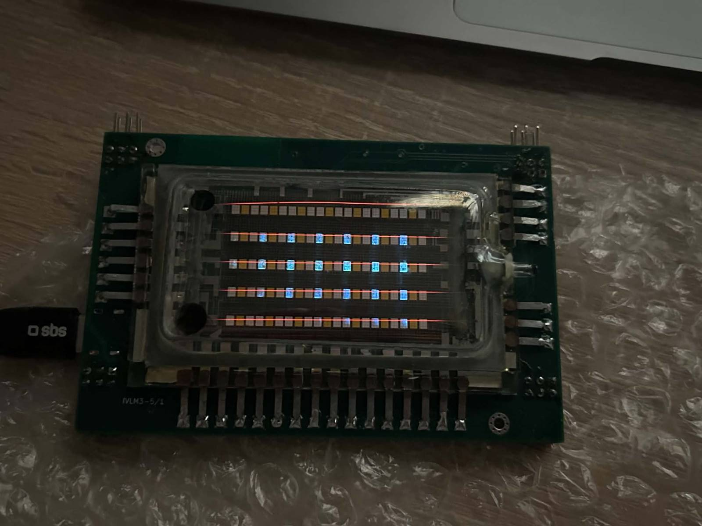
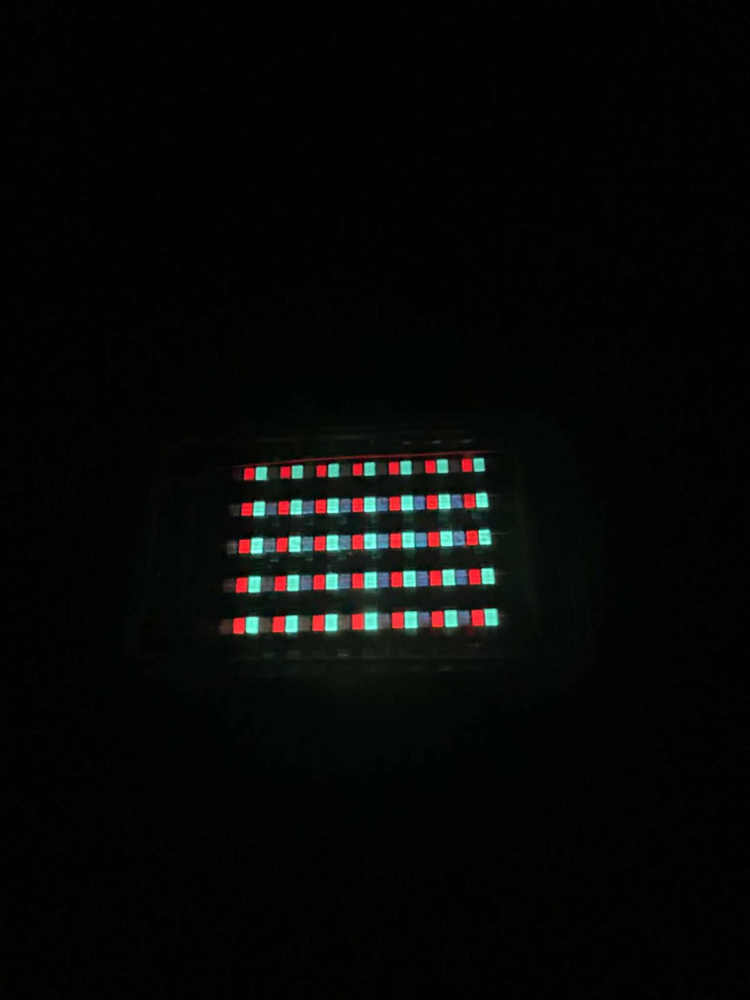

# IVLM3 driver board

This project was created to drive the old IVLM3-5/7 VFD displays. These tubes are tricolor 5×7 matrices that allow displaying arbitrary shapes, provided you stand far enough for the subpixels to blend. The board consists of several sections and is controlled via an ESP32-C6 module, which uses the HV5812 as the anode and grid driver. These tubes require anode voltages of up to 50V in pulse mode with 3V heating, so the board features a boost and buck converter to achieve these voltages.

**Assembled board.**  

**All pixels lit at 10V anode.**  

